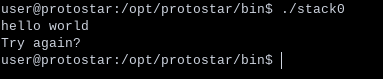
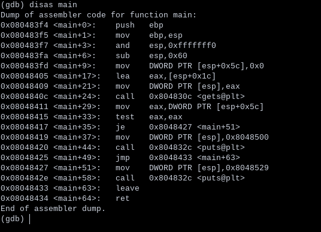

# Protostar 32-bit war machine.
For GDB:
```bash
define hook-stop
info registers
x/24wx $esp
x/2i $eip
```

Common Python usage:

```bash
python -c 'print("A"*n)'
```

## Stack0

The code at https://exploit.education/protostar/stack-zero/ lets us see that the input is taken
from a gets() function and storing the input in the buffer variable. Gets is a historically vulnerable C function. 
Neither the programmer nor the compiler can predict how many characters the gets() function will receive.

In many cases it can cause buffer overflows. 

First we should run the program. It asks for user input, and we may type whatever we want.



Using GDB we can check the disassembled instructions.



Buffer[] is allocated at $esp+0x5c, as seen in 0x08048411.The function gets() is called at 0x0804840c. The test
