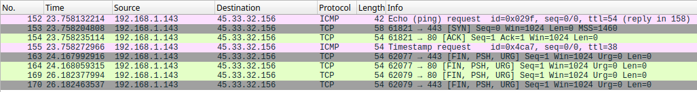

# Nmap notes!

Official docs: https://nmap.org/book/man-port-scanning-techniques.html

| Options | Name             | Description                                                                                                                                                     |
|---------|------------------|-----------------------------------------------------------------------------------------------------------------------------------------------------------------|
| -sS     | TCP SYN Scan     | Fast and stealthy scan. Only sends one TCP SYN package and does not answer back.                                                                                |
| -sT     | TCP Connect Scan | Slow, although stealthier than SYN scans, since it establishes a three-way-handshake. Less likely to be detected by an IDS or IPS.                              |
| -sU     | UDP Scan         | Slower scan, although it could give good results, since people more often than not forget that UDP ports can be scanned, they forget about them. Great mistake! |
| -sN     | NULL Scan        | Sets every TCP flag to NULL. Many Windows systems don't know what to do with these packages, which means that scanning them with this flag is unreliable.       |
| -sF     | FIN Scan         | Sets every TCP flag to FIN. Again, many Windows systems don't know what to di with these packages so the scan becomes unreliable on this systems.               |
| -sX     | XMAS Scan        | Sets all flags to FIN, URG and PSH. The scan has this name because the TCP package looks like a christmas tree.                                                 |

In a SYN or stealtg scan, a port will be considered to be open if Nmap receives a SYN-ACK answer. If it receives a RST call, 
the port may be closed. If no answer is received, the port will be considered to be filtering.

In a Connect scan, Nmap uses the high-level syscall connect(). It completes the three way handshake. It can be noisy, as some
services log connections. If the three way handshake is completed, the scanned port will be marked as open. It's a highly
reliable scan for TCP ports.

In a UDP scan, if a machine answers with a ICMP 3 code, the port is considered to be closed. If it responds with any other
ICMP code, it will be considered to be filtered. If and only if Nmap receives a UDP answer, the port will be considered open.

A NULL scan turns every TCP flag to NULL. This may confuse some systems, as they will not know what to do with these packages.
The scan works as follows: if X port receives a NULL package, it will answer with a RST packet, which means that the port is
considered to be closed. If we don't receive any response back, it means that the port is either filtereing or open. If we
receive an unreachable error (ICMP code 3) it means that the port is filtering, which means that there probably is a firewall
taking care of the server.

A FIN scan turns every TCP flag to FIN. Very similar to the NULL scan, with the difference being that if a port is open, it
replies with a FIN package, if the port is closed it sends back a TCP-RST package and if it is filtering we'll get a ICMP code 3
error.

A XMAS scan turns every TCP flag into FIN, URG and PSH. Similar to FIN and NULL scans, the scan may confuse Windows systems, so again,
this scan is unreliable when used in this operating system. We can know if a port is open if it replies with FIN, URG and/or PSH. If it
replies with a RST packet the port is closed. If we get a ICMP error code 3, the port is filtering.

